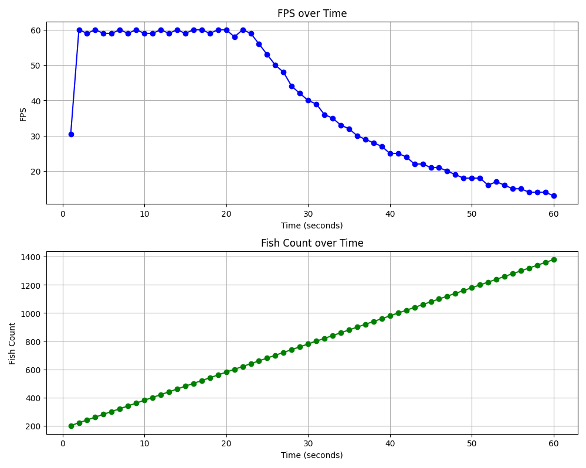
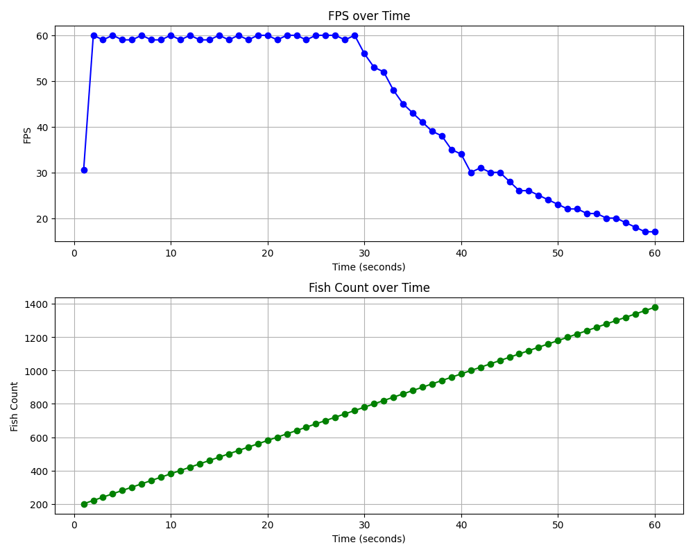

## Boids Algorithm

## About 
Boids is an artificial life program, developed by Craig Reynolds in 1986, which simulates the flocking behaviour of birds, and related group motion. His paper on this topic was published in 1987 in the proceedings of the ACM SIGGRAPH conference.[1] The name "boid" corresponds to a shortened version of "bird-oid object", which refers to a bird-like object.[2] Reynolds' boid model is one example of a larger general concept, for which many other variations have been developed since. The closely related work of Ichiro Aoki is noteworthy because it was published in 1982 — five years before Reynolds' boids paper.[3] 
## Model details
As with most artificial life simulations, Boids is an example of emergent behavior; that is, the complexity of Boids arises from the interaction of individual agents (the boids, in this case) adhering to a set of simple rules. The rules applied in the simplest Boids world are as follows:

- **separation**: steer to avoid crowding local flockmates
- **alignment**: steer towards the average heading of local flockmates
- **cohesion**: steer to move towards the average position (center of mass) of local 

(Reference: https://en.wikipedia.org/wiki/Boids)

## Update: 05.12.2024
I think The boids and algorithm is not working properly. Somewhat, after moving project to classes it become too bugged. Below are the known bugs, yet to be solved. 
    In any case, this state of project is now in releses as Stable v1. 
### Notes and Bugs
- Bug: There is a bug with the direction variable in fish class which is not doing a full circle instead it does with extra 45 degrees.
- Note: The fishes has a constant speed and the algorithm is based on the direction. The boid algorithm is not completely correct as it should been focused on the velocity vector.

The graph is made by capturing fps during one minute while adding 20 fihes a second.

## Update: 20.04.2026
After 2 years, I decided to rewrite this project. I solved many bugs and did some optimizations. The V1 was partially working and hard to understand, so I fixed the entire codebase and made it readable as possible. Also, added manuel and unit tests to be sure the calculations works correctly. Also, I tried to keep the best practices and hope efforts affected the result.

The velocity vector is not included yet. Currently, the project depends on constant speed instead. Next time I will be working on that.

The graph is made by capturing fps during one minute while adding 20 fihes a second.
